# Olá, eu sou o Luís Castilho 👋

<table>
  <tr>
    <td valign="top">
      
      
      
      
      
      
    </td>
    <td valign="top">
      
    </td>
  </tr>
</table>

---

### 👨‍💻 Sobre Mim

Entusiasta de tecnologia focado em construir interfaces de alta performance, experiências de usuário memoráveis e soluções robustas de infraestrutura. Tenho experiência sólida com o ecossistema **React** e **TypeScript**, sempre priorizando código limpo, arquitetura escalável e automação.

Além do desenvolvimento frontend, possuo forte interesse e engajamento em administração de sistemas, redes e virtualização, buscando sempre integrar práticas eficientes de desenvolvimento com infraestruturas modernas e seguras.

- 🎯 **Foco atual:** Arquitetura de software, automação de UI e gerenciamento de infraestrutura/containers.

---

### 🛠️ Minha Stack Tecnológica

| Categoria | Tecnologias |
| :--- | :--- |
| **Frontend** | React, Next.js, TypeScript, Tailwind CSS, HTML5, CSS3 |
| **Backend & Banco de Dados** | Node.js (Estudando / Integrando), REST APIs |
| **Infraestrutura & DevOps** | Docker, Linux (Debian), Proxmox, Git, GitHub Actions |
| **Ferramentas de Design** | Figma |

---

### 📬 Vamos nos conectar?

  
  

